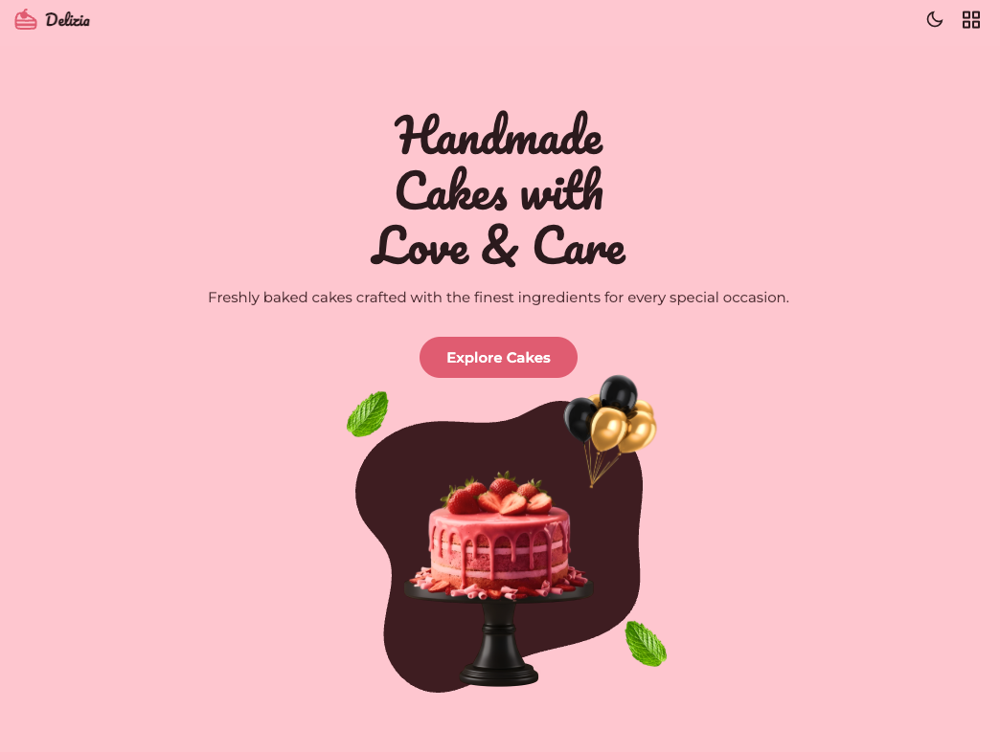

# website for study  (Ref:Bedimcode)

# Delizia — Cake Bakery Website



A one-page website for a cake shop. Built with HTML, CSS, and JavaScript.

## What's on the page

- **Home** — a slideshow of cakes with a "Explore Cakes" button
- **About** — a short story about the bakery
- **Products** — click a tab (Vanilla, Strawberry, Chocolate…) to see that category's cakes
- **New Arrivals** — the latest cakes with prices
- **Contact** — address, phone, email, and a message form

## Features

- Works on mobile, tablet, and desktop
- Dark and light mode toggle
- Smooth animations when you scroll down
- A "back to top" button that shows up when you scroll

## Built With

- HTML, CSS, JavaScript
- [Swiper.js](https://swiperjs.com/) — for the slideshows
- [ScrollReveal.js](https://scrollrevealjs.org/) — for the scroll animations
- [RemixIcons](https://remixicon.com/) — for the icons

## How to Run

Just open `index.html` in your browser. No setup needed.

Or use a local server:

```bash
npx serve .
```

## Files

```
cake-website/
├── index.html
└── assets/
    ├── css/styles.css
    ├── js/main.js
    └── img/
```


# cake-website
[Delizia Cake Website Preview](./assets/img/cake-website.png)
